# Apponline

## *What is Apponline ?*
- The primary goal of this application is to build a unmediated relationship with doctors.
- The patients can book their doctor's appointment online.
- Doctors have a seperate interface to manage their appointment.
- Get health related feeds.

## *How to use?*

### *The Login*
- Signup if visiting for the first time.
- Login directly if already signed up.

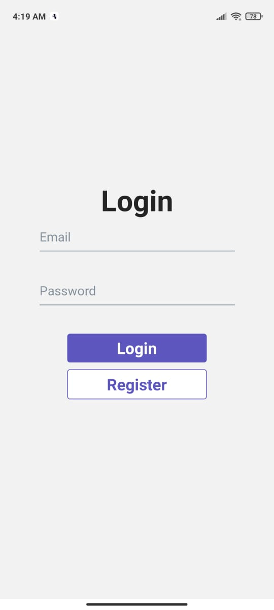

### *Home Screen*
- View popular doctors.

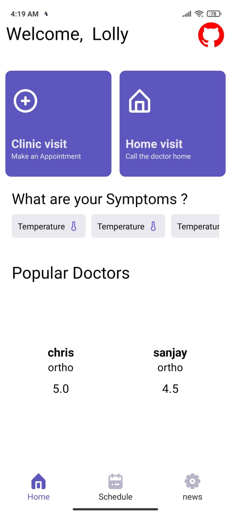

### *Schedule Screen*
- It screen is divided into 3 sections.
- Patients can track, view past appointment,  cancel their appointment.

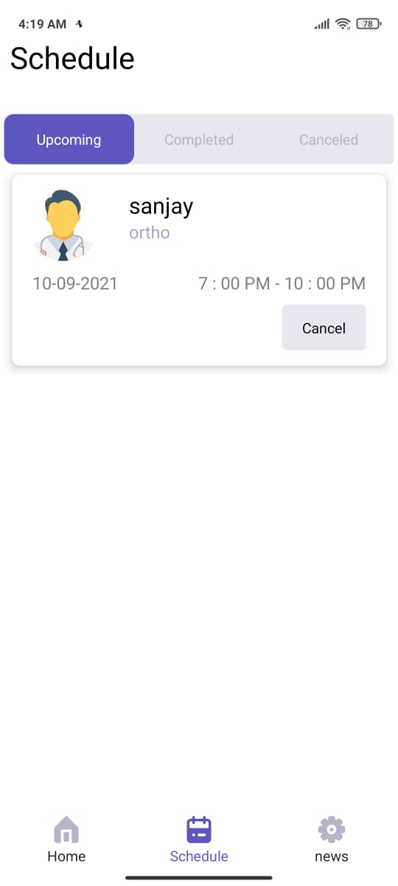
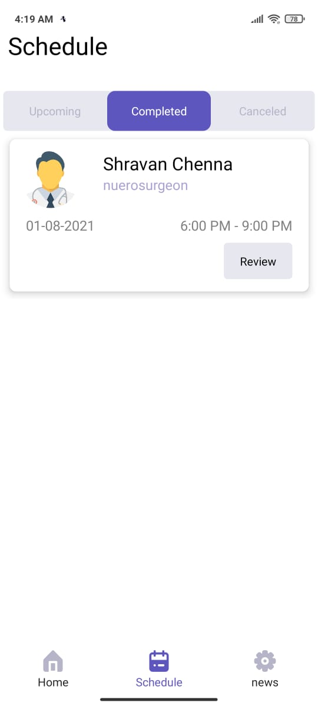
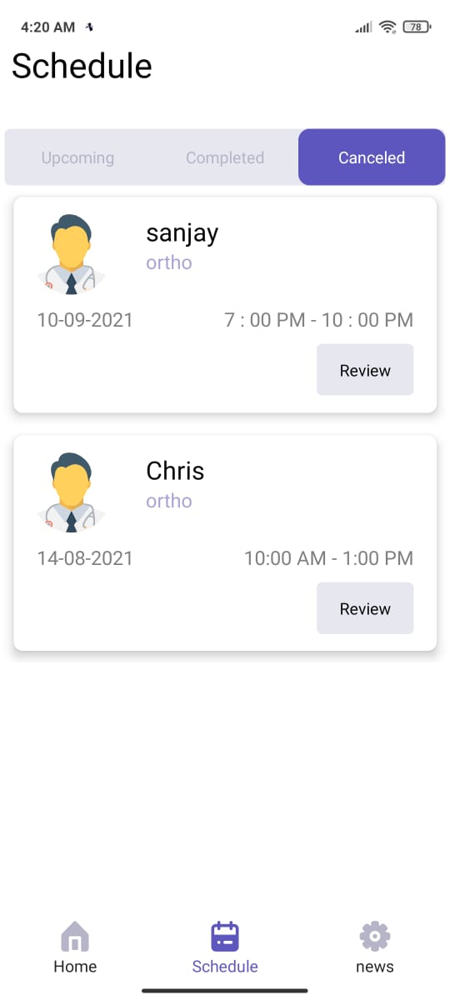

### *News Screen*
- It consist of daily news feed.

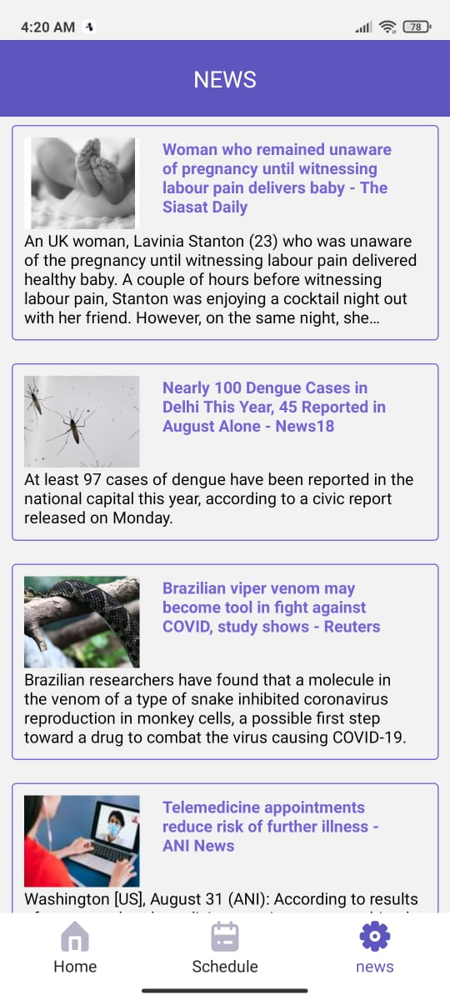

### *Doctors Schedule Screen*
- Here Doctors can select a slot and glimpse of all the patients.

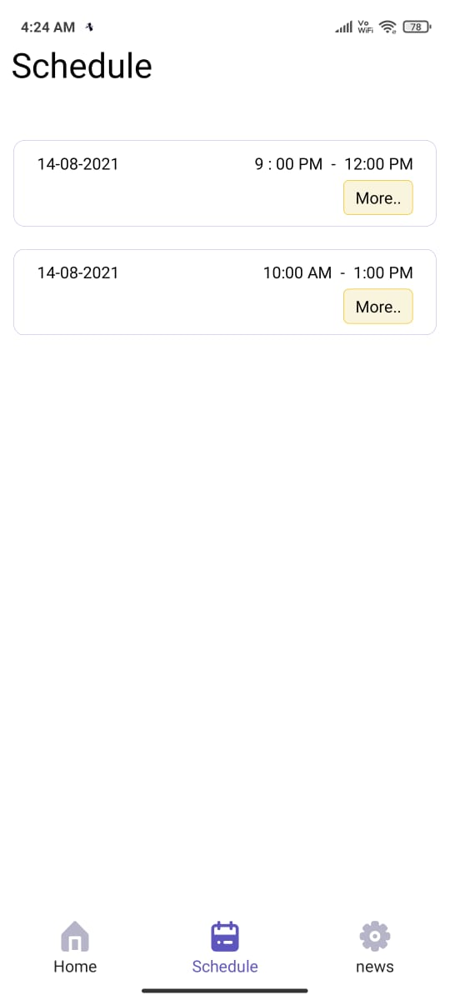
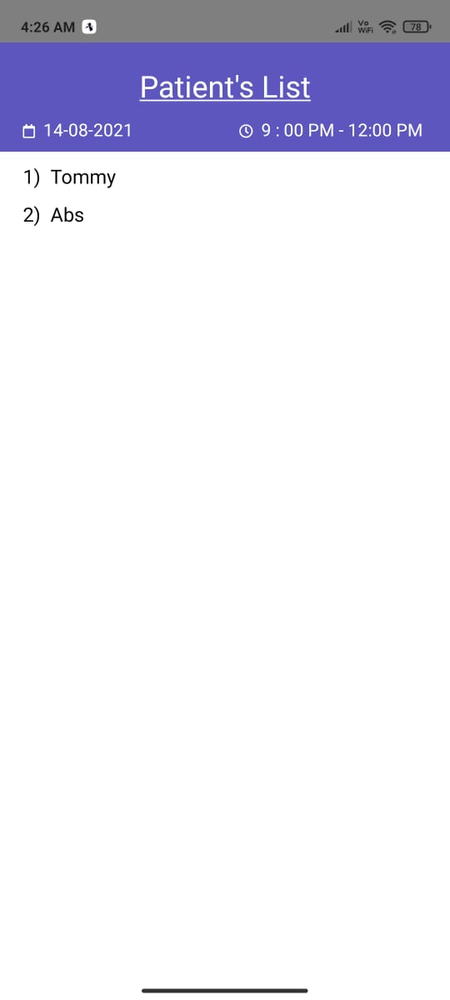

## *How to Book a Appointment?*
- Step 1 : Select Doctor.

- Step 2 : Click on Book an Appointment Button.

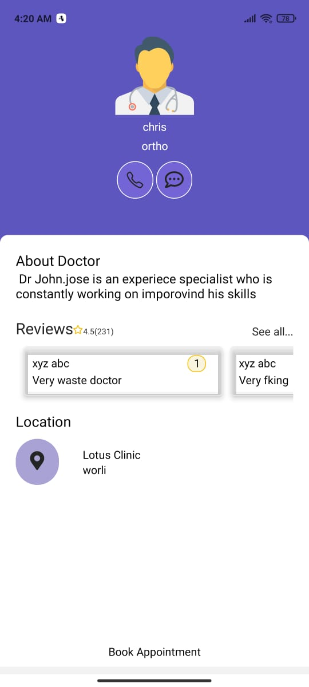

- Step 3 : Select a date for your appointment and time.

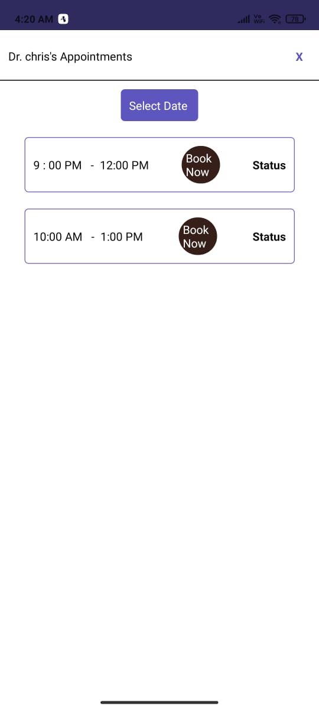

- Step 4 : Click on submit button and Hurray! your appointment has been booked.

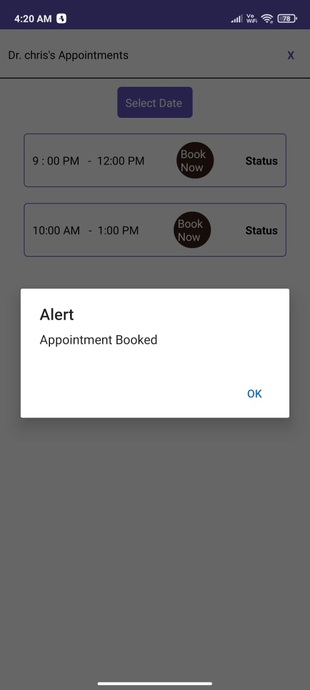

## *How to cancel a Appointment?*
- Step 1 : Go to Schedule screen.

- Step 2 : Click on cancel button and your appointment has been canceled.

## *How to give Review to doctor?*
- Step 1 : Go to Schedule screen.

- Step 2 : Click on Review Button.

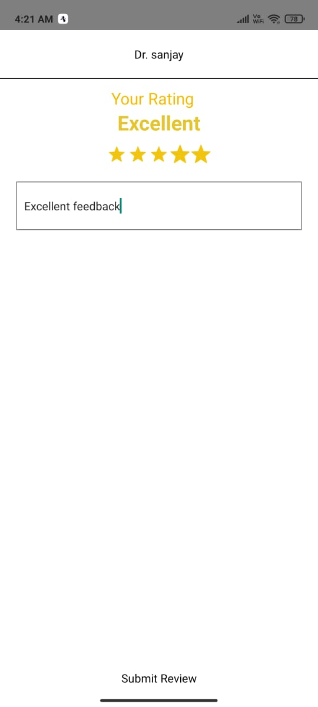

- Step 3 : Give your Review and hit on submit.

